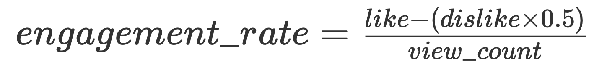
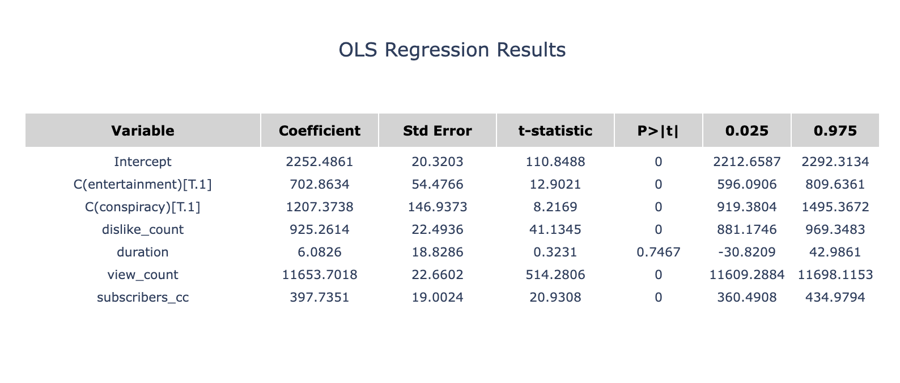
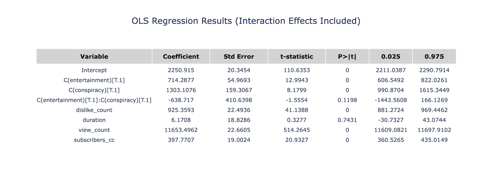

	

	

# A Dynamic Exploration of YouTube and Its Hidden Influences

Welcome to [our project](https://github.com/epfl-ada/ada-2024-project-kungfucooking), where data meets discovery. With metadata from over 136,000 YouTube channels, 72.9 million videos, and 8.6 billion comments, the [YouNiverse](https://github.com/epfl-dlab/YouNiverse/tree/master) dataset, opens a window into the intricate dynamics of YouTube—a platform that shapes public discourse, amplifies voices, and sometimes, distorts realities. At the heart of our journey lies a pressing question: How do conspiracy theories thrive in this vast digital ecosystem?

## Setting the Stage
What drives Donald Trump to embrace conspiracy theories, and how does YouTube amplify their impact? This study examines the relationship between Trump’s promotion of controversial narratives and their spread on YouTube. Through the analysis of millions of videos, we reveal how these theories not only captivate audiences but also foster higher levels of engagement across both mainstream and alternative channels.

Our findings shed light on YouTube’s unique role as a platform that amplifies these narratives, turning them into potent tools for emotional connection and influence. By exploring this dynamic, we aim to provide a deeper understanding of how such content shapes public discourse and audience behavior in the digital age.

	

## The Questions That Drive Us
1. How did Trump leverage conspiracy theories to command attention on YouTube?
2. Do videos containing conspiracy theory keywords garner higher engagement (likes, dislikes, views) compared to others?
3. Are entertainment-focused Trump-related videos driving more views, and how do subscription patterns shift before and after their release?
4. How do conspiracy-related keywords in titles or tags, combined with entertainment categorization, influence a video's engagement metrics?

### Key Findings: The Hidden Patterns of Influence and Engagement

## Proportion of conspiracy theory videos in different categories

To understand the distribution of conspiracy theories across YouTube, we first analyzed the proportion of videos containing conspiracy-related terms within different content categories. This analysis reveals that while conspiracy narratives appear across a range of categories, they are particularly concentrated in the News & Politics space. Such findings underscore the close association between conspiracy content and political discourse, though other categories like Entertainment and People & Blogs also show notable presence.

As shown in the figure below, these results highlight the varied but uneven spread of conspiracy theories across YouTube's content ecosystem.



## Comparative Analysis of Videos Containing Conspiracy Terms vs. Non-Conspiracy Content

We split the videos into two categories: videos containing conspiracy-related keywords and videos without conspiracy-related keywords.

The following Complementary Cumulative Distribution Function (**CCDF**) plots illustrate the distributional discrepancies in key engagement metrics—namely view counts, like counts, dislike counts, and like–dislike ratios, like-view-count ratio—between videos containing conspiracy-related keywords and those without such terminology. 
To compare the statistics, we employ hypothesis testing: Null hypothesis (**H0**) assumes there’s no significant difference in the engagement metrics, while alternative hypothesis (**H1**) posits that videos containing conspiracy-related keywords have noticeably higher or lower engagement metrics than those without.

### 1. Comparison on the view count

In this case above, **H0** is rejected at a significance level of α=0.01, showing that videos containing conspiracy-related keywords have significantly more views than those without. 

### 2. Comparison on the likes and dislikes count

In both cases above, **H0** is also rejected at a significance level of α=0.01. As a result, we can draw a conclusion that videos containing conspiracy-related keywords have significantly more likes and dislikes than those without. 

### 3. Comparison on the like/dislike ratio

Throught the comparison analysis, **H0** is also rejected at a significance level of α=0.01 in the like-dislike ratio case, which demonstrates that videos containing conspiracy-related keywords have significantly a higher like-dislike ratio than those without. 

### 4. Comparison on the like/view-count ratio and dislike/view-count ratio



Throught the comparison analysis, **H0** is rejected at a significance level of α=0.01 in the like-dislike ratio case, which demonstrates that people prefer to give more likes to videos containing conspiracy-related keywords than those without.



In this case above, **H0** is rejected at a significance level of α=0.01, demonstrating that people prefer to give less dislikes to videos containing conspiracy-related keywords than those without.

Conclusion: By utilizing non-parametric hypothesis testing procedures, specifically the Mann–Whitney U test and Wilcoxon Rank-Sum Test, we decisively reject the null hypothesis (**H0**) at a significance level of α=0.01, illustrating that videos containing conspiracy-related keywords have significantly more views, likes, dislikes and higher like-dislike ration than those without conspiracy-related keywords. Besides, people tend to give more likes and less dislikes to videos containing conspiracy-related keywords than those without.

## Tracing the Sequential Pathways of Trump-Related Conspiracy Theories on YouTube

### 1. Conspiracy Theory Distribution Map


### 2. Monthly Conspiracy Video Counts


A time-series analysis of these videos revealed two primary peaks in content volume: October 2018, coinciding with the U.S. midterm elections, and November 2019, aligning with the start of impeachment discussions. Given the significance of these periods, we focused our analysis on them.

### 3. Conspiracy Themes Frequency


From September to December 2019, mentions of the *Biden Family Scandal* surged in conspiracy content, driven by Trump’s focus on alleged Biden corruption amid the impeachment inquiry. Trump emphasized Hunter Biden’s Ukraine dealings to cast doubt on his political opponent and counter the impeachment narrative, fueling widespread conspiracy theories across media platforms.

From September to December 2018, *Deep State* and *QAnon* mentions spiked as Trump frequently referenced these conspiracies during the midterm election campaign. By highlighting the "Deep State", he sought to energize his base and frame opposition as part of a hidden government conspiracy, driving public interest and a surge of related content online.

### 4. Normalized Daily Conspiracy Video Counts



To analyze the features we want from the rather messy time series plots, we need to further perform correlation calculations, which means using the principle of convolution to find the temporal order.

### 5. Cross-Correlation of Conspiracy Categories


The images show cross-correlation of normalized video counts, where a negative lag at peak correlation indicates that the second channel type released content earlier. This highlights the sequential release pattern across channel categories.

The results indicate that Trump-related conspiracy content first appears in the People & Blogs category, followed by News & Politics and Entertainment. This sequence is understandable, as People & Blogs videos generally require minimal editing or production, reflecting the public's immediate response. For example, someone might record a segment of a Trump interview on their phone and post it online instantly. News & Politics content follows closely behind, as news segments typically involve more preparation and editing, leading to a slightly delayed release. Entertainment videos are posted later as entertainment creators tend to process information from blogs or news and take additional time to consider how best to adapt the content for maximum engagement, often through added commentary or creative reinterpretation.

## Transition: From Conspiracy Theories to Entertainment Channels

While conspiracy theories often dominate political discussions on YouTube, another critical facet of the platform lies in its entertainment content. Entertainment channels, with their vast reach and appeal, play a unique role in shaping audience engagement. Interestingly, these channels are not immune to the spread of conspiracy narratives, often packaging them in ways that maximize viewer interaction. By examining metrics like the **engagement_rate**, we can better understand the dynamics of audience response within this distinct category.

	

### 1. Exploring engagement_rate Differences Between Entertainment and Non-Entertainment Channels

To analyze audience engagement across different types of content, we calculated the **engagement_rate** using the formula:

This metric balances the positive feedback (likes) against negative feedback (dislikes), accounting for the fact that dislikes often carry less weight than likes in reflecting audience satisfaction. By scaling the result, the engagement_rate provides a normalized measure of engagement that allows meaningful comparisons across channels.

The chart below illustrates the distribution of like-ratio values for entertainment and non-entertainment channels. This visualization helps identify key differences in audience response, shedding light on how viewers perceive and interact with these two categories of content.We can find that for entertainment category videos, they have more tendency to have higher engagement_rate.



### 2. Causal Analysis of Conspiracy Words on Engagement_Rate

To investigate the impact of conspiracy-related content on engagement rates within a single entertainment channel, I conducted a causal analysis. Focusing on videos from the same channel helps minimize audience-related confounding factors, ensuring a more controlled comparison. To further enhance the robustness of the results, I employed a matching method based on **propensity scores**, incorporating variables such as `video_count`, `subscription`, and `duration`—factors likely to influence engagement.

The results show a higher average engagement rate for videos containing conspiracy-related content (0.063972) compared to those without (0.057420). Statistical tests confirm these findings:

\- **Shapiro-Wilk Test** indicates the data are not normally distributed (p-value < 0.001).

\- **Mann-Whitney U Test** reveals a significant difference in engagement rates between the two groups (p-value = 0.0077).

The distribution of engagement rates for conspiracy and non-conspiracy videos is visualized in the chart below, highlighting the differences between the two categories.



## Exploring the Intersection of Conspiracy Theories and Entertainment Content

### Analyzing the Importance of each factor by Comparing the Coefficients in Linear Regression

We plan to perform a linear regression on the like count using the remaining factors, assessing the impact of each factor on the like count based on their weights.

We can see that **after data normalization**, the positive impact of views on the like count is the largest. At the same time, whether the video is categorized as entertainment and whether it contains conspiracy theory keywords in the title or tags also have a significant positive impact on the like count. It can be seen from the p-value that the influence of these factors is significant.

Furthermore, we will explore the interaction between the factors of whether a video is categorized as entertainment ('entertainment' = 1) and whether it contains conspiracy theory keywords in the title or tags ('conspiracy' = 1).  We will introduce the interaction term of the two factors to perform linear regression.

**Surprisingly, the coefficient of the interaction term between the two is actually negative.** This means that, all else being equal, if a video with 'entertainment' = 1 and 'conspiracy' = 1 tends to have fewer likes than videos with 'entertainment' = 1 but 'conspiracy' = 0 or videos with 'conspiracy' = 1 but 'entertainment' = 0. However, the p-value of the interaction term is greater than 0.05, so this effect *may not be significant*.

 In the figure, we can see that the average number of likes for videos with 'entertainment' = 1 and 'conspiracy' = 1 is lower than that of videos with 'entertainment' = 1 but 'conspiracy' = 0, as well as slightly lower than that of videos with 'conspiracy' = 1 but 'entertainment' = 0.

 However, this analysis is very naive because entertainment videos without conspiracy keywords may have a much larger sample size than those with conspiracy-related keywords, and the view count for videos without conspiracy keywords may be higher than that for videos with conspiracy-related keywords, leading to this phenomenon. Therefore, we hope to **balance the data** to verify whether the number of likes for entertainment videos without conspiracy keywords is significantly greater than that for entertainment videos with conspiracy-related keywords.

### 2. Using Logistic Regression to Balance the Data
First, we calculate the propensity score to balance the data by **Logistic Regression**.



However, due to the high computational complexity of matching the data, we will sample the data before matching the instances.

In the balanced data, the average like count for entertainment videos with conspiracy keywords is lower than the average like count for entertainment videos with conspiracy-related keywords.



By plotting the distribution of likes for the two groups of data, we can see that the proportion of videos with more than 2,000 likes is higher for entertainment videos with conspiracy-related keywords (the treated group).

Mann-Whitney U Test reveals that the median of the treated group is actually significantly larger than the control group (p-value = 2.09e-10).

	

## Conclusion and Outlook

In this study, we systematically analyzed the presence and impact of conspiracy-related content centered around Donald Trump on YouTube. Our work explored the proportion of videos containing Trump’s conspiracy keywords across different categories, conducted a comparative analysis of engagement metrics between videos with and without these keywords, and traced the sequential pathways through which such narratives propagate on the platform. Additionally, we investigated entertainment channels and identified intriguing trends, such as the higher average like counts for videos with Trump-related conspiracy terms in their titles or tags compared to their view counts.

As Trump prepares to take office again in 2025, the use of conspiracy-related rhetoric is likely to remain a critical element of his political strategy. With his established ability to dominate online discourse, Trump may continue to utilize these keywords to expand his political influence, rally his base, and steer public narratives in his favor. Such tactics could play a significant role in shaping his administration’s communication strategy and its broader political agenda.

Future research should focus on monitoring the evolving use of Trump-related conspiracy narratives, particularly their impact on political communication and public opinion. It will also be essential to explore strategies for addressing the potential risks posed by such narratives to democratic discourse while preserving the principles of free expression in the digital sphere.