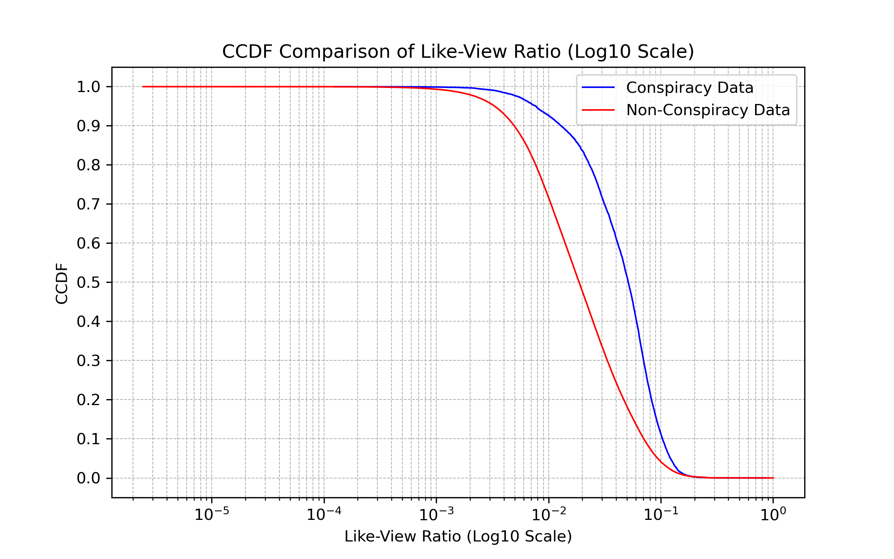
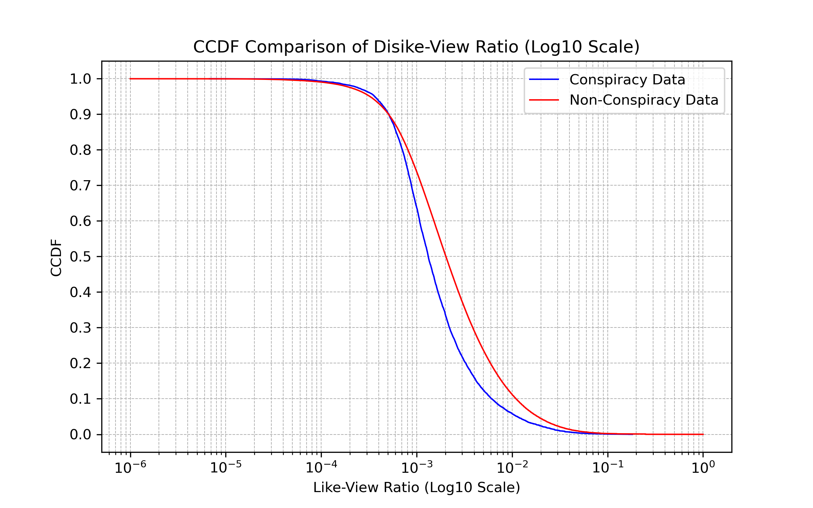

	

	

# A Dynamic Exploration of YouTube and Its Hidden Influences

Welcome to [our project](https://github.com/epfl-ada/ada-2024-project-kungfucooking), where data meets discovery. With metadata from over 136,000 YouTube channels, 72.9 million videos, and 8.6 billion comments, the [YouNiverse](https://github.com/epfl-dlab/YouNiverse/tree/master) dataset, opens a window into the intricate dynamics of YouTube—a platform that shapes public discourse, amplifies voices, and sometimes, distorts realities. At the heart of our journey lies a pressing question: How do conspiracy theories thrive in this vast digital ecosystem?

## Setting the Stage
Our research dives deep into the phenomenon of conspiracy theories, with a particular focus on the narratives propagated by Donald Trump. By analyzing millions of videos, we uncover the pathways through which these theories spread and evolve. From emotional engagement to amplified reach via mainstream and alternative channels, our findings illustrate the power of YouTube in shaping political and social discourse.

## The Questions That Drive Us
1. How did Trump leverage conspiracy theories to command attention on YouTube?
2. Do videos containing conspiracy theory keywords garner higher engagement (likes, dislikes, views) compared to others?
3. Are entertainment-focused Trump-related videos driving more views, and how do subscription patterns shift before and after their release?
4. How do conspiracy-related keywords in titles or tags, combined with entertainment categorization, influence a video's engagement metrics?

### Key Findings: The Hidden Patterns of Influence and Engagement

## 1.Proportion of conspiracy theory videos in different categories



## 2.Comparative Analysis of Videos Containing Conspiracy Terms vs. Non-Conspiracy Content

We split the videos into two categories: videos containing conspiracy-related keywords and videos without conspiracy-related keywords.

The following Complementary Cumulative Distribution Function (**CCDF**) plots illustrate the distributional discrepancies in key engagement metrics—namely view counts, like counts, dislike counts, and like–dislike ratios, like-view-count ratio—between videos containing conspiracy-related keywords and those without such terminology. 
To compare the statistics, we employ hypothesis testing: Null hypothesis (**H0**) assumes there’s no significant difference in the engagement metrics, while alternative hypothesis (**H1**) posits that videos containing conspiracy-related keywords have noticeably higher or lower engagement metrics than those without.

### 1. Comparison on the view count

In this case above, **H0** is rejected at a significance level of α=0.01, showing that videos containing conspiracy-related keywords have significantly more views than those without. 

### 2. Comparison on the likes and dislikes count

In both cases above, **H0** is also rejected at a significance level of α=0.01. As a result, we can draw a conclusion that videos containing conspiracy-related keywords have significantly more likes and dislikes than those without. 

### 3. Comparison on the like/dislike ratio

Throught the comparison analysis, **H0** is also rejected at a significance level of α=0.01 in the like-dislike ratio case, which demonstrates that videos containing conspiracy-related keywords have significantly a higher like-dislike ratio than those without. 

### 4. Comparison on the like/view-count ratio and dislike/view-count ratio

Throught the comparison analysis, **H0** is rejected at a significance level of α=0.01 in the like-dislike ratio case, which demonstrates that people prefer to give more likes to videos containing conspiracy-related keywords than those without.

In this case above, **H0** is rejected at a significance level of α=0.01, demonstrating that people prefer to give less dislikes to videos containing conspiracy-related keywords than those without.

Conclusion: By utilizing non-parametric hypothesis testing procedures, specifically the Mann–Whitney U test and Wilcoxon Rank-Sum Test, we decisively reject the null hypothesis (**H0**) at a significance level of α=0.01, illustrating that videos containing conspiracy-related keywords have significantly more views, likes, dislikes and higher like-dislike ration than those without conspiracy-related keywords. Besides, people tend to give more likes and less dislikes to videos containing conspiracy-related keywords than those without.

## Tracing the Sequential Pathways of Trump-Related Conspiracy Theories on YouTube

### 1. Conspiracy Theory Distribution Map


### 2. Monthly Conspiracy Video Counts


A time-series analysis of these videos revealed two primary peaks in content volume: October 2018, coinciding with the U.S. midterm elections, and November 2019, aligning with the start of impeachment discussions. Given the significance of these periods, we focused our analysis on them.

### 3. Conspiracy Themes Frequency


From September to December 2019, mentions of the *Biden Family Scandal* surged in conspiracy content, driven by Trump’s focus on alleged Biden corruption amid the impeachment inquiry. Trump emphasized Hunter Biden’s Ukraine dealings to cast doubt on his political opponent and counter the impeachment narrative, fueling widespread conspiracy theories across media platforms.

From September to December 2018, *Deep State* and *QAnon* mentions spiked as Trump frequently referenced these conspiracies during the midterm election campaign. By highlighting the "Deep State", he sought to energize his base and frame opposition as part of a hidden government conspiracy, driving public interest and a surge of related content online.

### 4. Normalized Daily Conspiracy Video Counts



To analyze the features we want from the rather messy time series plots, we need to further perform correlation calculations, which means using the principle of convolution to find the temporal order.

### 5. Cross-Correlation of Conspiracy Categories


The images show cross-correlation of normalized video counts, where a negative lag at peak correlation indicates that the second channel type released content earlier. This highlights the sequential release pattern across channel categories.

The results indicate that Trump-related conspiracy content first appears in the People & Blogs category, followed by News & Politics and Entertainment. This sequence is understandable, as People & Blogs videos generally require minimal editing or production, reflecting the public's immediate response. For example, someone might record a segment of a Trump interview on their phone and post it online instantly. News & Politics content follows closely behind, as news segments typically involve more preparation and editing, leading to a slightly delayed release. Entertainment videos are posted later as entertainment creators tend to process information from blogs or news and take additional time to consider how best to adapt the content for maximum engagement, often through added commentary or creative reinterpretation.

## task4



We can find that for entertainment category videos, they have more tendency to have higher like-ratios.



We can find that there is strong difference between conspiracy videos and non-conspiracy videos on engagement rate.

## task5

The above figure is a log-log scatter plot of likes versus views. From the graph, we can infer that the number of likes is generally positively correlated with the number of views.

We plan to perform a linear regression on the like count using the remaining factors, assessing the impact of each factor on the like count based on their weights.



We can see that after normalization, the positive impact of views on the like count is the largest. At the same time, whether the video is categorized as entertainment and whether it contains conspiracy theory keywords in the title or tags also have a significant positive impact on the like count. It can be seen from the p-value that the influence of these factors is significant.

Furthermore, we will explore the interaction between the factors of whether a video is categorized as entertainment and whether it contains conspiracy theory keywords in the title or tags.  We will introduce the interaction term of the two factors to perform linear regression.



Surprisingly, the coefficient of the interaction term between the two is actually negative. This means that, all else being equal, if a video is an entertainment video with conspiracy-related keywords in its title or tags, it tends to have fewer likes than entertainment videos without conspiracy keywords or non-entertainment videos with conspiracy keywords. However, the p-value of the interaction term is greater than 0.05, so this effect may not be significant.



In the figure, we can see that the average number of likes for entertainment videos with conspiracy-related keywords in the title or tags is lower than that of entertainment videos without conspiracy keywords, as well as lower than that of non-entertainment videos with conspiracy keywords.

However, this analysis is very naive because entertainment videos without conspiracy keywords may have a much larger sample size than those with conspiracy-related keywords, and the view count for videos without conspiracy keywords may be higher than that for videos with conspiracy-related keywords, leading to this phenomenon. Therefore, we hope to balance the data to verify whether the number of likes for entertainment videos without conspiracy keywords is significantly greater than that for entertainment videos with conspiracy-related keywords in the title or tags.

We can see that the average view count for entertainment videos without conspiracy keywords is nearly five times that of entertainment videos with conspiracy-related keywords in the title or tags. This may be due to the presence of more extreme values in the sample of entertainment videos without conspiracy keywords.

First, we calculate the propensity score to balance the data.



Due to the high computational complexity of matching the data, we will sample the data first.

In the balanced data, the average view count for entertainment videos with conspiracy keywords is lower than the average like count for entertainment videos with conspiracy-related keywords in the title or tags.



By plotting the distribution of likes for the two groups of data, we can see that the proportion of videos with more than 2,000 likes is higher for entertainment videos with conspiracy-related keywords in the title or tags.
